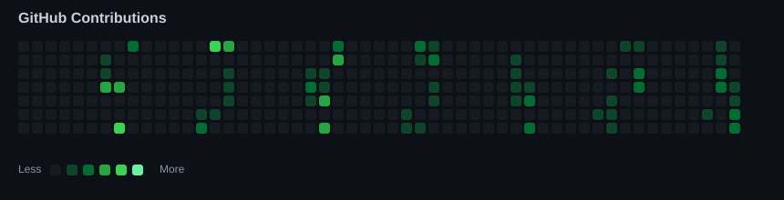

<h3><code>Ritik@github ~ $ ./contributions.sh</code></h3>

  

<h3><code>Ritik@github ~ $ whoami</code></h3>

  👋 Hi, I'm <b>Ritik Kose</b> 
  💻 B.Tech CSE | Cyber Security 
  🚀 Learning DSA, Web Development & AI

 

<h3><code>Ritik@github ~ $ skills</code></h3>

  Java • Python • C • HTML • CSS • JavaScript • Git & GitHub

